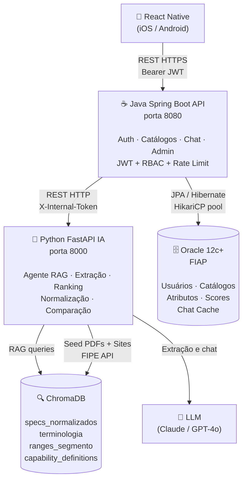

# Ford Catalog API — Backend Java

API REST para análise competitiva de catálogos automotivos. Orquestra extração via agente IA (Python), persiste resultados no Oracle e expõe endpoints para o app mobile (React Native).

**Stack:** Java 21 · Spring Boot 3.2.5 · Spring Security (JWT) · JPA/Hibernate · Oracle 23c · Flyway

---

## Diagrama de Arquitetura



---

## Endpoints

### Autenticação — `/api/auth` (público)

| Método | Path | Auth | Descrição |
|--------|------|------|-----------|
| POST | `/api/auth/login` | Nenhuma | Autentica e retorna Bearer JWT (8h) |
| POST | `/api/auth/register` | Bearer + ADMIN | Cria usuário com role admin/analista/viewer |

### Catálogos — `/api/catalogos` (autenticado)

| Método | Path | Auth | Descrição |
|--------|------|------|-----------|
| GET | `/api/catalogos` | Bearer | Lista todos os catálogos (ordem desc) |
| GET | `/api/catalogos/{id}` | Bearer | Detalha catálogo com atributos e capability scores |
| POST | `/api/catalogos/extrair` | Bearer + ANALISTA/ADMIN | Dispara extração via agente IA |
| POST | `/api/catalogos/comparar` | Bearer | Tabela comparativa de 2–6 veículos |
| GET | `/api/catalogos/ranking` | Bearer | Ranking ponderado por perfil de uso |

### Chat RAG — `/api/chat` (autenticado)

| Método | Path | Auth | Descrição |
|--------|------|------|-----------|
| POST | `/api/chat` | Bearer | Pergunta em linguagem natural sobre os catálogos |

### Administração — `/api/admin` (somente ADMIN)

| Método | Path | Auth | Descrição |
|--------|------|------|-----------|
| GET | `/api/admin/termos-pendentes` | Bearer + ADMIN | Lista termos desconhecidos detectados pela IA |
| GET | `/api/admin/termos-pendentes/{id}` | Bearer + ADMIN | Detalha termo por ID |
| PATCH | `/api/admin/termos-pendentes/{id}` | Bearer + ADMIN | Atualiza status (mapeado/descartado) |
| GET | `/api/admin/termos-pendentes/resumo` | Bearer + ADMIN | Contagem por status |

### Health

| Método | Path | Auth | Descrição |
|--------|------|------|-----------|
| GET | `/actuator/health` | Nenhuma | Status da aplicação |

---

## Documentação Interativa (Swagger)

Com a aplicação rodando, acesse:

```
http://localhost:8080/swagger-ui.html
```

O JSON OpenAPI 3 está disponível em:

```
http://localhost:8080/v3/api-docs
```

---

## Variáveis de Ambiente

| Variável | Obrigatório | Descrição |
|----------|-------------|-----------|
| `ORACLE_URL` | Não (tem default) | JDBC URL do Oracle (default: FIAP) |
| `ORACLE_USER` | **Sim** | Usuário Oracle (ex: RM555211) |
| `ORACLE_PASSWORD` | **Sim** | Senha Oracle |
| `JWT_SECRET` | **Sim** | Chave HMAC-SHA256 ≥ 256 bits (use `openssl rand -base64 64`) |
| `PYTHON_SERVICE_URL` | Não | URL do microsserviço IA (default: http://localhost:8000) |
| `INTERNAL_API_KEY` | Não | Token interno Java→Python (X-Internal-Token) |
| `CORS_ALLOWED_ORIGINS` | Não | Origens permitidas separadas por vírgula (default: http://localhost:8081) |
| `FORD_ADMIN_PASSWORD` | Não | Senha do usuário admin seed (criado no startup se não existir) |

Copie `.env.example` para `.env` e preencha os valores obrigatórios.

---

## Como Rodar

### Com Docker Compose (recomendado)

```bash
# Na raiz do projeto
cp .env.example .env
# Editar .env com as credenciais Oracle e JWT_SECRET
docker compose up --build
```

### Local (Maven)

```bash
cd backend-java
export ORACLE_USER=RM555211
export ORACLE_PASSWORD=sua_senha
export JWT_SECRET=$(openssl rand -base64 64)
mvn spring-boot:run
```

---

## Roles e Permissões (RBAC)

| Role | Permissões |
|------|------------|
| `admin` | Todas as operações + gerenciar usuários e termos |
| `analista` | Extrair catálogos + todas as consultas |
| `viewer` | Somente leitura (listar, buscar, comparar, ranking, chat) |

Usuários padrão criados no startup (via `FORD_ADMIN_PASSWORD`):
- `admin@ford.com.br` — role admin
- `analista@ford.com.br` — role analista

---

## Migrações (Flyway)

Os scripts DDL estão versionados em `src/main/resources/db/migration/`:

| Versão | Arquivo | Conteúdo |
|--------|---------|----------|
| V1 | `V1__create_tables.sql` | 8 tabelas principais |
| V2 | `V2__create_indexes.sql` | 12 índices de performance |
| V3 | `V3__seed_data.sql` | Usuários padrão |
| V5 | `V5__lgpd_soft_delete.sql` | Soft delete / LGPD |

O Flyway aplica as migrações automaticamente no startup. Se o banco já existir (Oracle FIAP), a flag `baseline-on-migrate=true` evita reexecução.
