# Galeria de telas — AutoSight Mobile

Prints reais do app (build web Expo, viewport 390x844) com a stack completa no ar: Java API + Oracle FIAP + microsserviço IA, via gateway nginx `:8082`.  
Wireframe interativo: [gallery.html](gallery.html).

| Tela | Print |
|------|-------|
| Login | 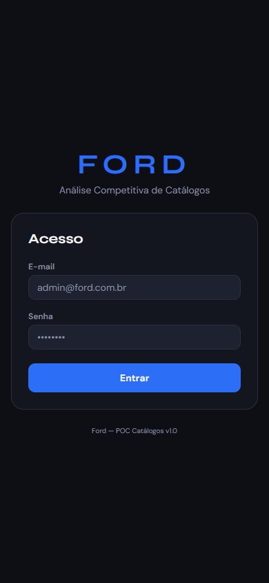 |
| Home / ficha técnica | 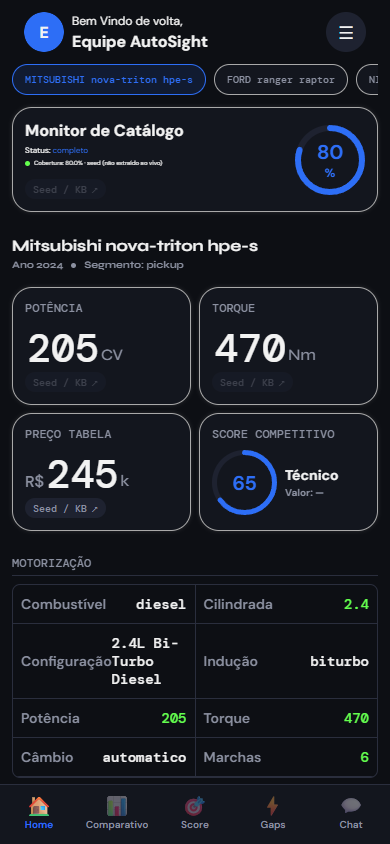 |
| Comparativo (Ford Ranger x Toyota Hilux) | 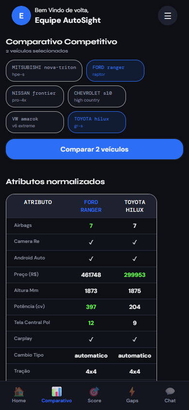 |
| Score competitivo (perfil desempenho) | 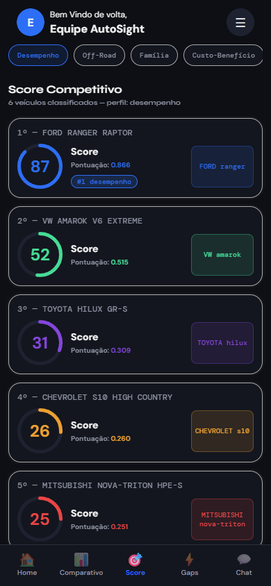 |
| Gaps acionáveis | 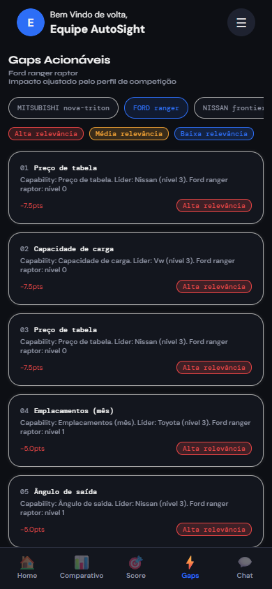 |
| Chat RAG | 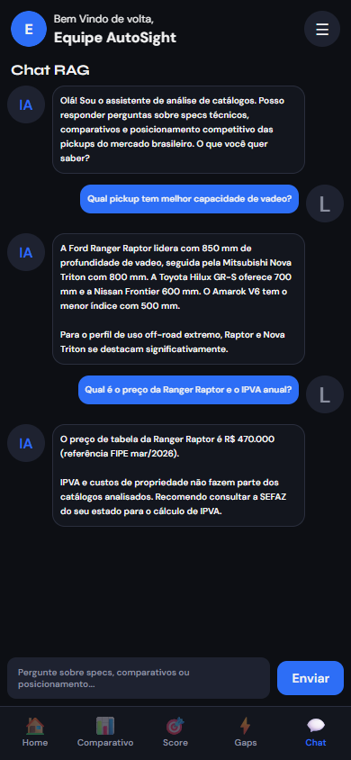 |
| Timeline de mudanças | 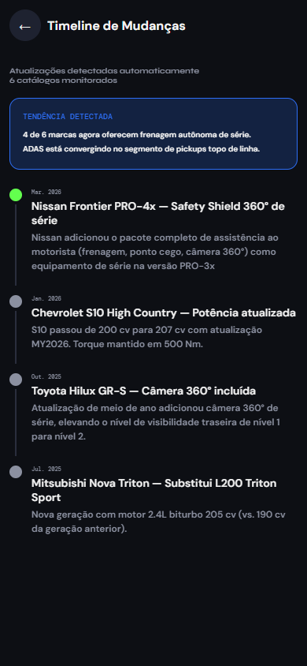 |
| Termos pendentes (admin) | 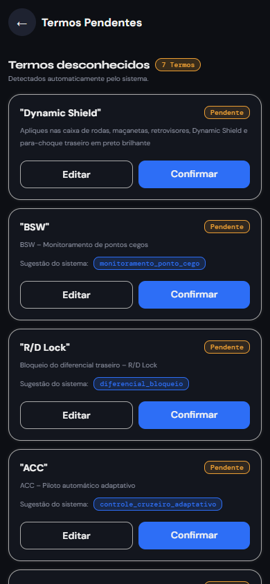 |
| Status do agente | 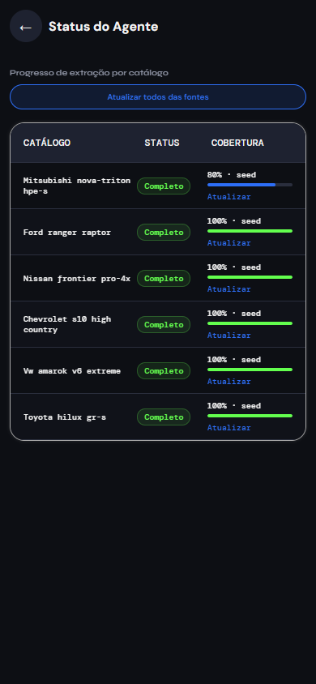 |
| Alertas de segurança | 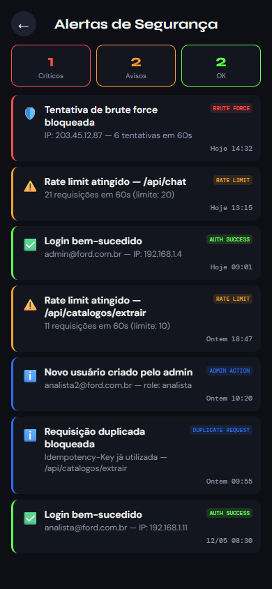 |
| Configuração de score | 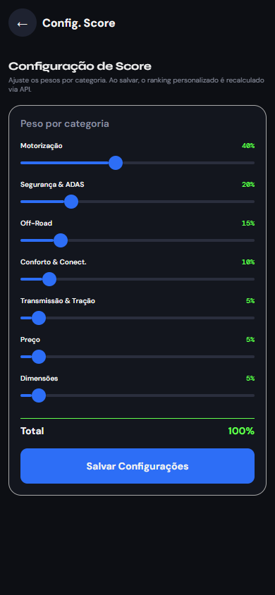 |
| Menu / drawer | 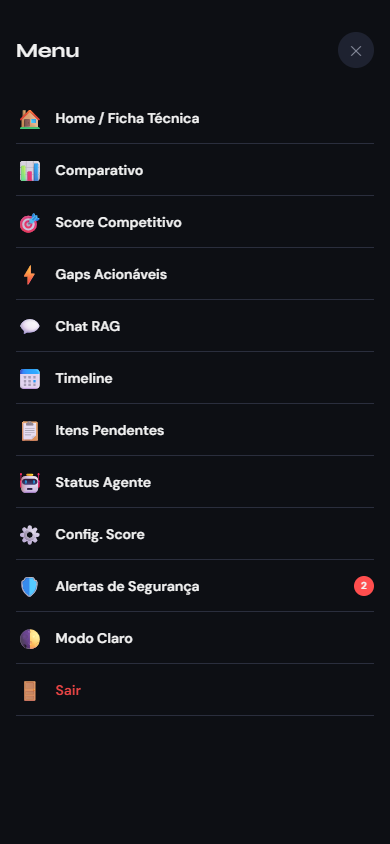 |

## Como recapturar

```bash
./start.sh            # ou start.bat — sobe nginx, java-api, python-ia
cd mobile
EXPO_PUBLIC_API_URL=same-origin npx expo export --platform web
# abrir http://localhost:8082 em viewport 390x844 e percorrer as telas
```
